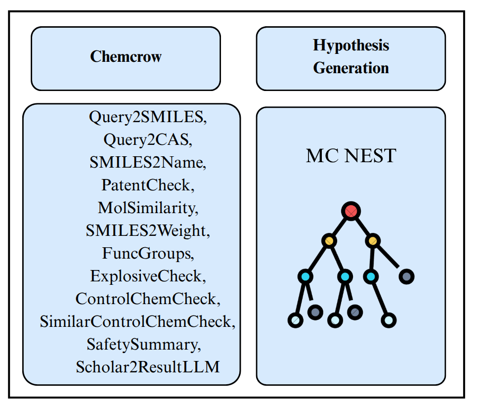
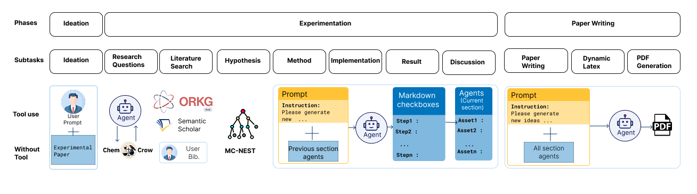
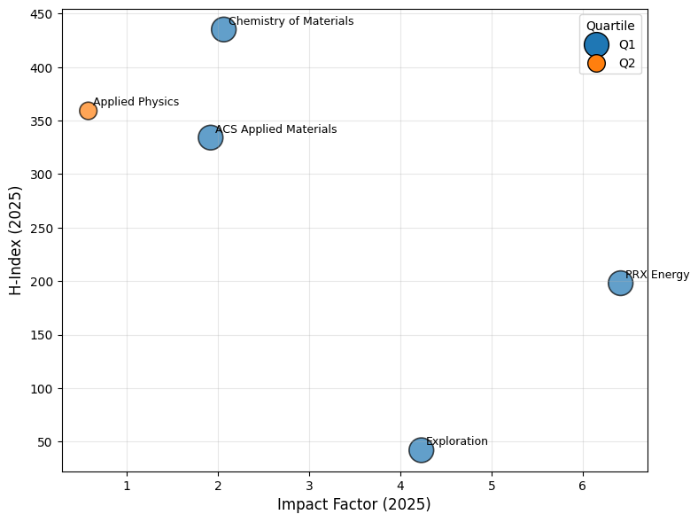
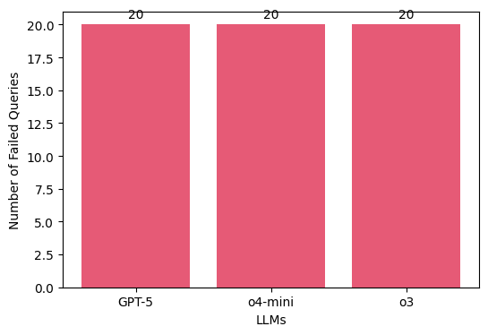

# TIB AIssitant Alchemy.


The github provides a comprehensive project structure for the ChemChrow as a tool and MC Nest Hypothesis Generation as Tools integrated in [TIB AIssistant](https://gitlab.com/TIBHannover/orkg/tib-aissistant/web-app) developed for [Large Language Model (LLM) Hackathon for Applications in Materials Science and Chemistry 2025](https://llmhackathon.github.io/).

We believe the integration of the tools into TIB AIssistant enhances the research workflow of chemists and material scientists. We hope, this also open doors to integrate more comprehensive tools that could boost the research and validate hypothesis in respective domains.


## Our Project

We develop ChemCrow and MC NEST Hypothesis Generation as tools in a research workflow of [TIB AIssistant](https://gitlab.com/TIBHannover/orkg/tib-aissistant/web-app). We initially developed and hosted a fastapi to convert the chemistry tools as an api from the chemcrow [library](https://github.com/ur-whitelab/chemcrow-public/tree/main). We also inspired from the [MC NEST Hypothesis](https://arxiv.org/pdf/2411.15645) generation algorithm to validate and come up with best chemical and material science hypothesis. We also developed and hosted an another fastapi to be integrated with TIB AIssistant.

<p align="center">
  <br>
  <em>Figure: Tools developed and integrated into TIB AIssistant</em>
</p>


## Installation

```
uv sync
```

### Run ChemCrow tool api
```
uv run chemcrow_tool/app.py
```

### Run MC NEST Hypothesis Generation API
```
uv run mc_nest_hypo_gen/app.py
```

The above commands open the ports at http://0.0.0.0:5001 for chemcrow and http://0.0.0.0:8000 for MC Nest Hypothesis Generation. This provides ability to self-host these tools and integrate with any agents or models possible.

Here, we integrate these APIs into TIB AIssistant which improves the hypothesis generation and validate chemical analysis using ChemCrow tools through the research workflow.


## Experimentation

We follow a workflow to generate ideas, experiments and papers based on our approach and compare the generated papers with actual human papers.

<p align="center">
  <br>
  <em>Figure: Experimentation pipeline to evaluate the efficiency of MCNEST and ChemCrow tools</em>
</p>


### Paper Collection

We sample papers from chemistry and material science journals published in 2025 to evaluate the MC-NEST and chemcrow tool's ability to  improve the research workflow.


<p align="center">
  <br>
  <em>Figure: Representation of the journals of the papers.</em>
</p>


#### Memory evaluation

We also try to evaluate if the LLMs memorize about the papers that we are testing on to make sure the results are not biased. From our evaluation, we concluded the three LLMs that we use o3, 04-mini, gpt-5 do not memorize any papers that could bias the results.

<p align="center">
  <br>
  <em>Figure: Memorization analysis of the LLMs we test the tools and reports on.</em>
</p>


## Limitations and Future Work
* Hallucinations
    - Citations
    - Hypothesis
    - Report formats

* Comprehensive evaluation
    - Plagiarism check
    - Time and cost analysis
    - Ablation studies
    - Domain expert analysis
    - Failed experiment analysis

# Ethical and Safety Considerations
* Researchers should consider the safety concerns of the new chemical compounds and solutions suggested by AI.
* We recommend AI assisting as a human expertise with Human AI collabortion to fully automated scientific exploration.
* The Human-in-the-loop should take all the responsibility of the decision made through the process.


## References
```
@article{bran2023chemcrow,
      title={ChemCrow: Augmenting large-language models with chemistry tools},
      author={Andres M Bran and Sam Cox and Oliver Schilter and Carlo Baldassari and Andrew D White and Philippe Schwaller},
      year={2023},
      eprint={2304.05376},
      archivePrefix={arXiv},
      primaryClass={physics.chem-ph},
      publisher={arXiv}
}

@article{rabby2024mc,
  title={MC-NEST: Enhancing Mathematical Reasoning in Large Language Models leveraging a Monte Carlo Self-Refine Tree},
  author={Rabby, Gollam and Keya, Farhana and Auer, S{\"o}ren},
  journal={arXiv preprint arXiv:2411.15645},
  year={2024}
}
```


